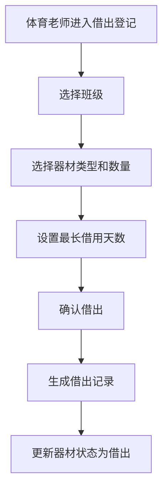
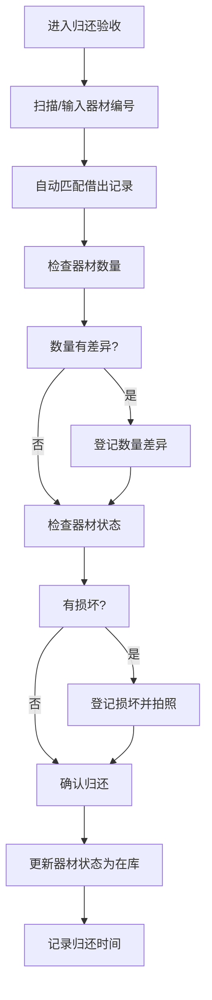
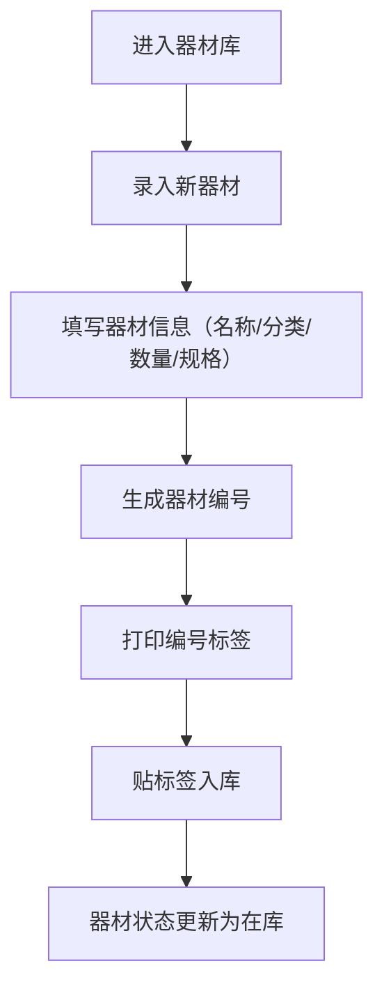

## 1. 产品概述

智慧体育器材借还桌面客户端是专为学校体育组设计的器材管理系统，用于高效管理篮球、跳绳、秒表和训练器械的日常借还流转。系统支持器材档案管理、班级批量借出、扫码归还、损坏登记、逾期提醒及统计分析等核心功能，帮助体育老师在课前快速完成整班借用，提升器材管理效率。

## 2. 核心功能

### 2.1 用户角色

| 角色 | 登录方式 | 核心权限 |
|------|---------|---------|
| 体育老师 | 本地账号登录 | 器材管理、借出登记、归还验收、损坏处理、统计查询、系统设置 |

### 2.2 功能模块

1. **器材库**：器材档案录入、器材编号管理、器材分类浏览、器材状态查询、器材编号打印
2. **借出登记**：按班级借出、个人借用登记、借用期限设置、批量借出操作
3. **归还验收**：扫码归还、数量差异登记、损坏检查、归还确认
4. **班级统计**：班级借用统计、热门器材排行、个人借用历史查询、补采购清单生成
5. **损坏处理**：损坏照片记录、损坏原因登记、维修/报废处理、损坏器材追踪

### 2.3 页面详情

| 页面名称 | 模块名称 | 功能描述 |
|---------|---------|---------|
| 器材库 | 器材列表 | 分类筛选、搜索、分页展示器材信息 |
| 器材库 | 器材录入 | 新增器材、编辑器材信息、删除器材 |
| 器材库 | 编号打印 | 生成器材编号标签、打印预览 |
| 借出登记 | 班级借出 | 选择班级、批量选择器材、设置借用天数 |
| 借出登记 | 个人借出 | 登记借用人信息、选择器材、确认借出 |
| 借出登记 | 逾期提醒 | 显示逾期未还器材列表、提醒标记 |
| 归还验收 | 扫码归还 | 扫描器材编号、自动识别借出记录 |
| 归还验收 | 数量核对 | 登记借出与归还数量差异 |
| 归还验收 | 损坏检查 | 归还时检查器材状态、登记损坏 |
| 班级统计 | 班级统计 | 按班级统计借用次数、借用时长 |
| 班级统计 | 热门器材 | 统计借用频率最高的器材排行 |
| 班级统计 | 个人历史 | 查询个人/班级借用历史记录 |
| 班级统计 | 补采购清单 | 根据库存和使用频率生成采购建议 |
| 班级统计 | 期末盘点 | 导出期末盘点表、库存统计 |
| 损坏处理 | 损坏登记 | 记录损坏器材、上传损坏照片、填写原因 |
| 损坏处理 | 损坏列表 | 查看所有损坏记录、按状态筛选 |
| 损坏处理 | 处理操作 | 标记维修中、已修复、已报废 |

## 3. 核心流程

### 3.1 班级借出流程

### 3.2 归还验收流程

### 3.3 器材管理流程

## 4. 用户界面设计

### 4.1 设计风格

- **主色调**：深蓝色系（#1e3a5f），传达专业、稳重的体育管理氛围
- **辅助色**：活力橙色（#f97316），用于强调和操作按钮，象征运动活力
- **中性色**：灰色系（#f8fafc, #e2e8f0, #64748b, #1e293b）
- **按钮风格**：圆角矩形，悬停时有微妙的阴影和颜色过渡
- **字体**：主标题使用系统粗体，正文使用清晰易读的无衬线字体
- **布局风格**：左侧导航栏 + 右侧内容区的经典桌面应用布局
- **卡片式设计**：各功能模块以卡片形式呈现，层次分明
- **图标风格**：使用 Lucide 线性图标，简洁现代

### 4.2 页面设计概览

| 页面名称 | 模块名称 | UI 元素 |
|---------|---------|---------|
| 器材库 | 顶部操作栏 | 搜索框、分类筛选、新增器材按钮、打印按钮 |
| 器材库 | 器材列表 | 卡片网格/列表视图切换、器材图片、编号、名称、状态标签 |
| 器材库 | 器材详情弹窗 | 器材完整信息、编辑/删除操作 |
| 借出登记 | 班级选择区 | 年级/班级下拉选择、借用人信息 |
| 借出登记 | 器材选择区 | 可勾选的器材列表、数量调整、借用天数设置 |
| 借出登记 | 逾期提醒区 | 红色警示卡片、逾期天数、快速归还入口 |
| 归还验收 | 扫码区 | 大号输入框、模拟扫码按钮、最近归还列表 |
| 归还验收 | 归还详情 | 借出信息对比、数量差异输入、损坏勾选 |
| 班级统计 | 数据看板 | 统计卡片、柱状图、排行榜 |
| 班级统计 | 历史记录 | 表格展示、筛选条件、导出按钮 |
| 损坏处理 | 损坏列表 | 时间线布局、损坏照片缩略图、状态标签 |
| 损坏处理 | 损坏登记 | 表单、图片上传区、原因描述 |

### 4.3 响应式

桌面端优先设计，最小支持 1280px 宽度。由于是桌面客户端，不考虑移动端适配。

### 4.4 动效设计

- 页面切换：淡入淡出过渡
- 卡片悬停：轻微上浮 + 阴影加深
- 按钮点击：缩放反馈
- 数据加载：骨架屏渐变动画
- 成功/错误提示：从顶部滑入的 Toast 消息
