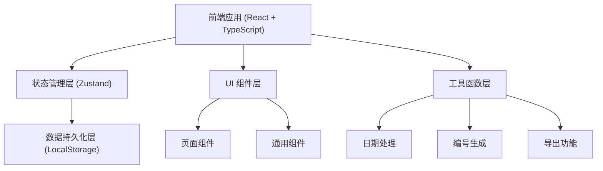

## 1. 架构设计



## 2. 技术描述

- **前端框架**: React 18 + TypeScript
- **构建工具**: Vite
- **样式方案**: Tailwind CSS 3
- **状态管理**: Zustand
- **路由管理**: React Router DOM
- **图标库**: Lucide React
- **数据持久化**: LocalStorage（模拟桌面端本地存储）
- **图表库**: 自定义 SVG 图表（轻量级，避免引入大型图表库）

> 技术选型说明：由于是桌面客户端应用，采用纯前端技术栈 + LocalStorage 数据持久化的方式，便于后续打包为 Electron 桌面应用。无需后端服务，所有数据本地存储。

## 3. 路由定义

| 路由路径 | 页面名称 | 说明 |
|---------|---------|------|
| /equipment | 器材库 | 器材档案管理、编号打印 |
| /borrow | 借出登记 | 班级/个人借出、逾期提醒 |
| /return | 归还验收 | 扫码归还、数量差异、损坏检查 |
| /statistics | 班级统计 | 数据看板、历史查询、补采购清单、盘点导出 |
| /damage | 损坏处理 | 损坏登记、处理追踪 |

## 4. 数据模型

### 4.1 数据模型定义

```mermaid
erDiagram
    EQUIPMENT ||--o{ BORROW_RECORD : "被借用"
    BORROW_RECORD ||--o| DAMAGE_RECORD : "关联"
    CLASS ||--o{ BORROW_RECORD : "班级借用"

    EQUIPMENT {
        string id PK "器材ID"
        string code "器材编号"
        string name "器材名称"
        string category "分类: 篮球/跳绳/秒表/训练器械"
        string specification "规格"
        int totalQuantity "总数量"
        int availableQuantity "可用数量"
        string status "状态: 在库/借出/维修中/报废"
        string location "存放位置"
        date purchaseDate "采购日期"
        string remark "备注"
        string imageUrl "图片URL"
    }

    BORROW_RECORD {
        string id PK "记录ID"
        string equipmentId FK "器材ID"
        int quantity "借用数量"
        string borrowerType "借用人类型: 班级/个人"
        string className "班级名称"
        string borrowerName "借用人姓名"
        date borrowDate "借出日期"
        date dueDate "应还日期"
        date returnDate "实际归还日期"
        int returnedQuantity "已归还数量"
        string status "状态: 借出中/已归还/部分归还/逾期"
        string remark "备注"
    }

    DAMAGE_RECORD {
        string id PK "记录ID"
        string equipmentId FK "器材ID"
        string borrowRecordId FK "借出记录ID"
        date damageDate "发现日期"
        string damageType "损坏类型: 轻微/严重/报废"
        string description "损坏描述"
        string photoUrl "损坏照片"
        string status "处理状态: 待处理/维修中/已修复/已报废"
        string handler "处理人"
        date handleDate "处理日期"
        string handleResult "处理结果"
    }

    CLASS {
        string id PK "班级ID"
        string name "班级名称"
        string grade "年级"
    }

    SETTINGS {
        int maxBorrowDays "最长借用天数"
        string schoolName "学校名称"
    }
```

### 4.2 初始数据结构

```typescript
// 器材分类
type EquipmentCategory = 'basketball' | 'rope' | 'stopwatch' | 'training';

// 器材状态
type EquipmentStatus = 'available' | 'borrowed' | 'repairing' | 'scrapped';

// 借用记录状态
type BorrowStatus = 'borrowing' | 'returned' | 'partial' | 'overdue';

// 损坏状态
type DamageStatus = 'pending' | 'repairing' | 'fixed' | 'scrapped';

interface Equipment {
  id: string;
  code: string;
  name: string;
  category: EquipmentCategory;
  specification: string;
  totalQuantity: number;
  availableQuantity: number;
  status: EquipmentStatus;
  location: string;
  purchaseDate: string;
  remark: string;
  imageUrl: string;
  borrowCount: number; // 借用次数统计
}

interface BorrowRecord {
  id: string;
  equipmentId: string;
  equipmentName: string;
  equipmentCode: string;
  quantity: number;
  borrowerType: 'class' | 'individual';
  className: string;
  borrowerName: string;
  borrowDate: string;
  dueDate: string;
  returnDate?: string;
  returnedQuantity: number;
  status: BorrowStatus;
  quantityDiff: number; // 数量差异（归还时登记）
  remark: string;
}

interface DamageRecord {
  id: string;
  equipmentId: string;
  equipmentName: string;
  borrowRecordId?: string;
  damageDate: string;
  damageType: 'minor' | 'serious' | 'scrapped';
  description: string;
  photoUrl: string;
  status: DamageStatus;
  handler: string;
  handleDate?: string;
  handleResult: string;
}

interface ClassInfo {
  id: string;
  name: string;
  grade: string;
}

interface AppSettings {
  maxBorrowDays: number;
  schoolName: string;
}
```

## 5. 项目目录结构

```
src/
├── components/          # 通用组件
│   ├── Layout/          # 布局组件（侧边导航、顶部栏）
│   ├── Card/            # 卡片组件
│   ├── Button/          # 按钮组件
│   ├── Modal/           # 弹窗组件
│   ├── Table/           # 表格组件
│   ├── Form/            # 表单组件
│   └── Toast/           # 消息提示组件
├── pages/               # 页面组件
│   ├── Equipment/       # 器材库页面
│   ├── Borrow/          # 借出登记页面
│   ├── Return/          # 归还验收页面
│   ├── Statistics/      # 班级统计页面
│   └── Damage/          # 损坏处理页面
├── store/               # Zustand 状态管理
│   ├── equipmentStore.ts
│   ├── borrowStore.ts
│   ├── damageStore.ts
│   └── settingsStore.ts
├── utils/               # 工具函数
│   ├── idGenerator.ts   # ID/编号生成
│   ├── dateUtils.ts     # 日期处理
│   ├── exportUtils.ts   # 导出功能
│   └── storage.ts       # 本地存储封装
├── types/               # TypeScript 类型定义
│   └── index.ts
├── data/                # Mock 数据
│   └── mockData.ts
├── hooks/               # 自定义 Hooks
│   └── useToast.ts
├── App.tsx              # 应用入口
├── main.tsx             # 渲染入口
└── index.css            # 全局样式
```

## 6. 核心功能模块设计

### 6.1 器材编号生成规则

格式：分类前缀 + 年份 + 序号（3位）
- 篮球：BASK + 年份 + 序号（例：BASK2024001）
- 跳绳：ROPE + 年份 + 序号（例：ROPE2024001）
- 秒表：TIME + 年份 + 序号（例：TIME2024001）
- 训练器械：TRAI + 年份 + 序号（例：TRAI2024001）

### 6.2 逾期提醒计算

根据当前日期与应还日期比较：
- 逾期 1-3 天：黄色提醒
- 逾期 3 天以上：红色警告
- 借出时根据设置的最长借用天数自动计算应还日期

### 6.3 统计与导出

- 热门器材：按借用次数降序排列
- 班级统计：按班级统计借用次数和器材数量
- 补采购清单：库存不足阈值 + 借用频率综合计算
- 期末盘点：导出 CSV 格式的盘点表
